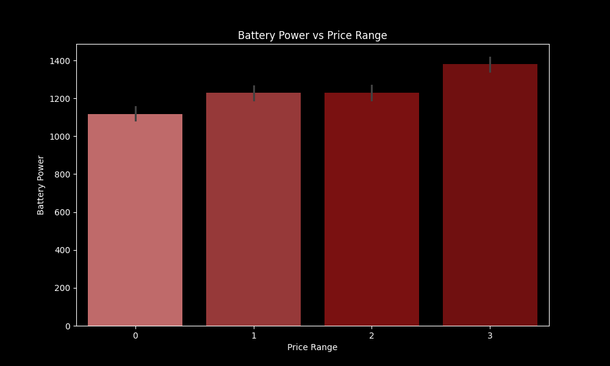
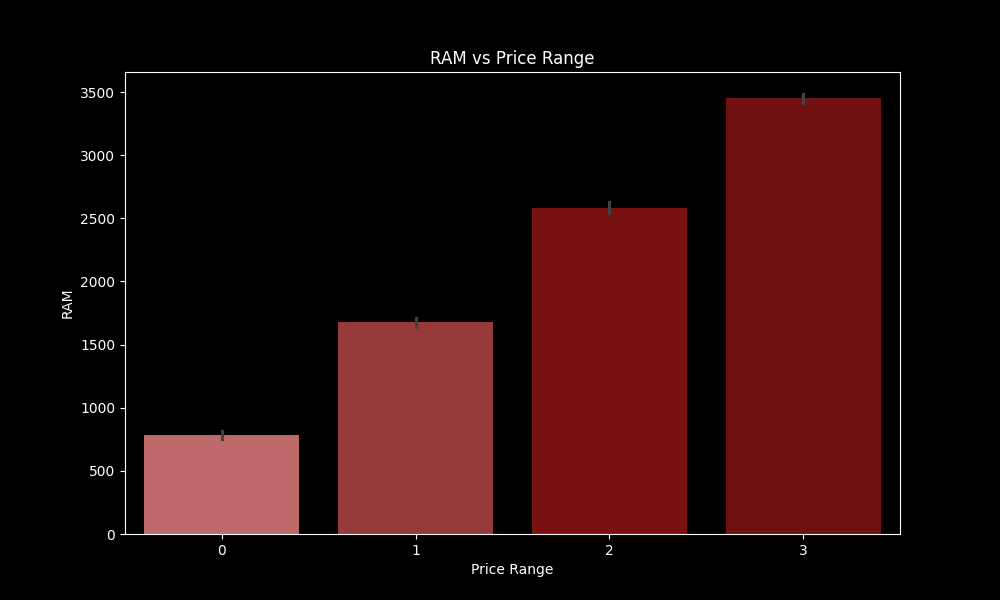
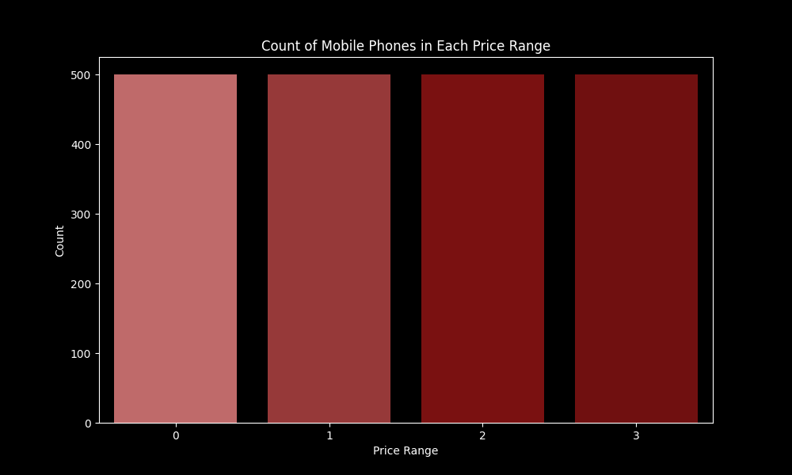
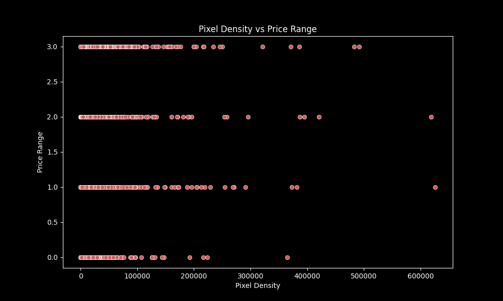
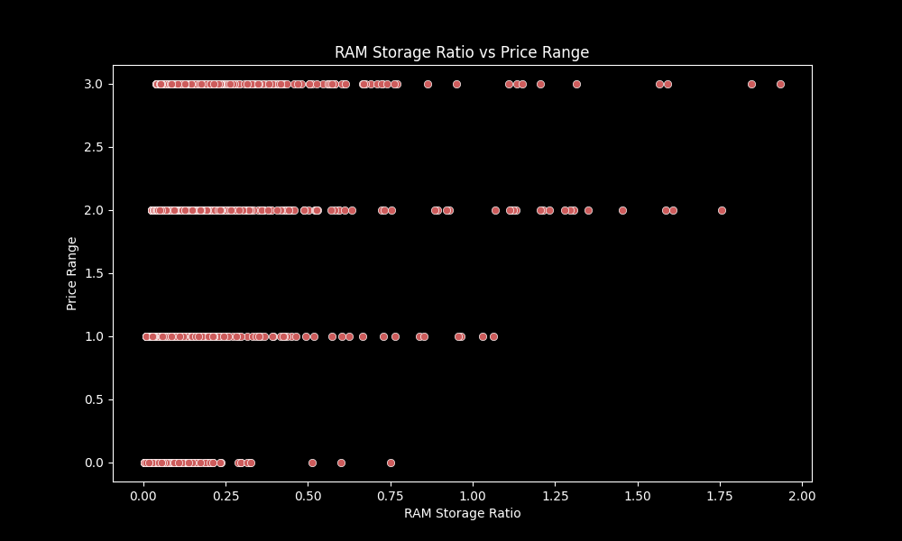
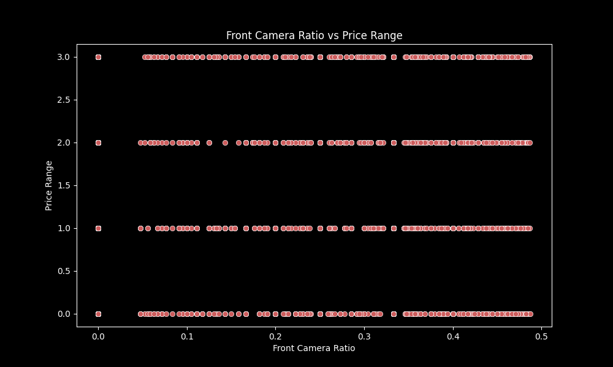
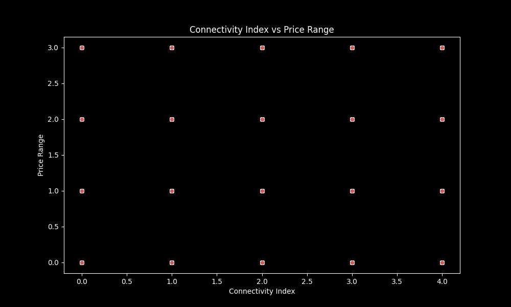
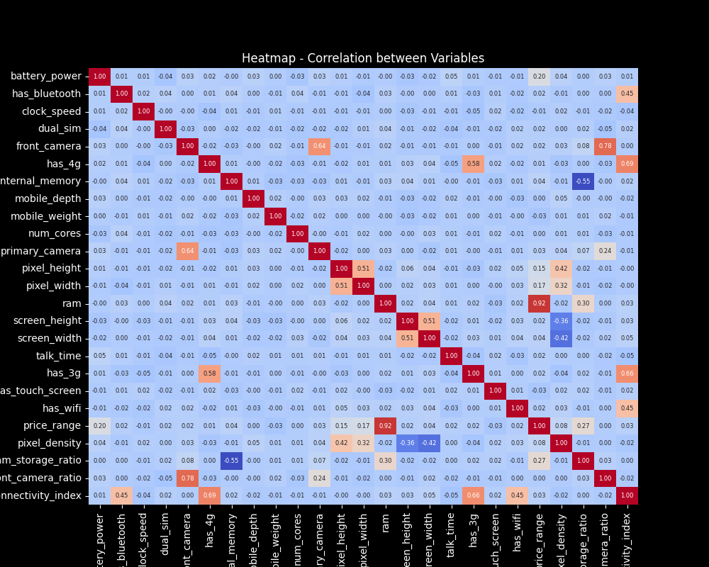
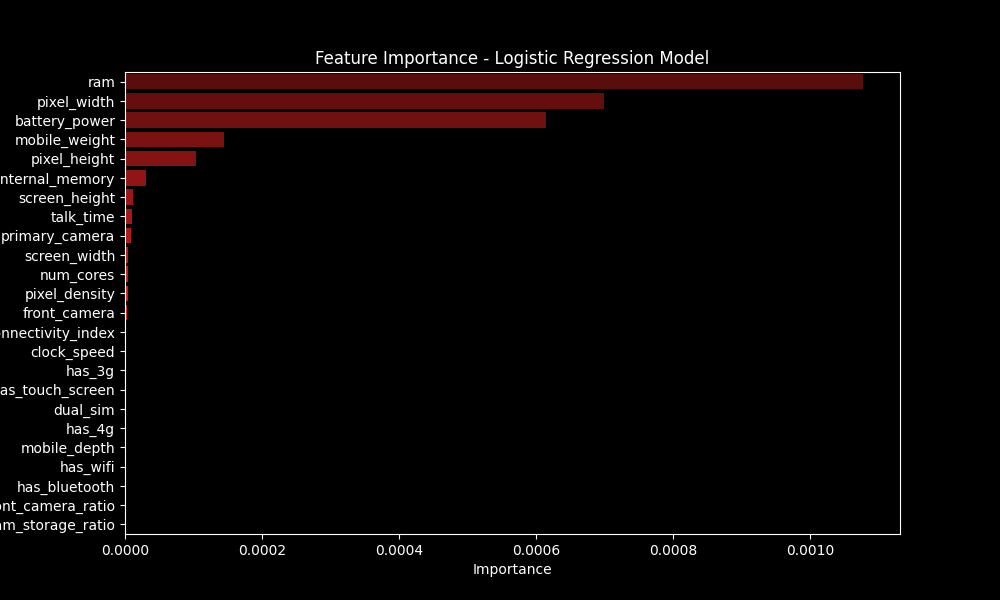
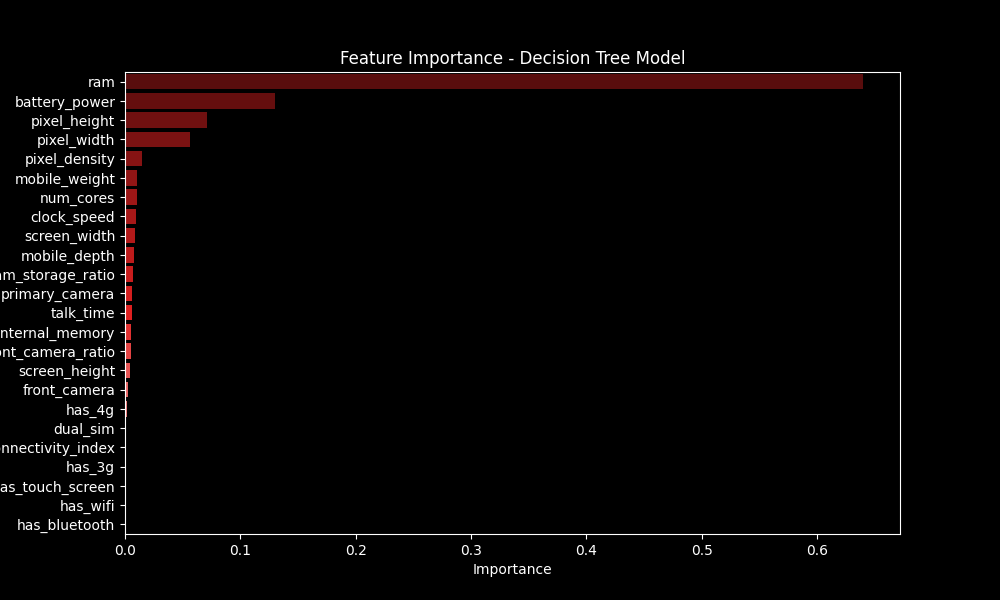

## Objective of the Code:

This code aims to perform exploratory analysis and create three machine learning models to predict price ranges of mobile devices based on various features and also explores the importance of these features in logistic regression, decision tree, and random forest models.

## Why choose those models?

### Logistic Regression:

- **Applicability**: Since the task involves predicting price ranges (which can be converted into binary classes), logistic regression is suitable.
  
- **Interpretability**: Logistic regression provides interpretable results, making it easier to observe the impact of each feature on the price range.
  
- **Efficiency**: Logistic regression can handle large datasets well, making it good for initial modeling.

### Decision Tree:

- **Non-Linearity**: Decision trees can capture non-linear relationships between features and target variables which is good since mobile device prices can be influenced by various non-linear factors.
  
- **Feature Importance**: Decision trees provide feature importance scores that can help us identify which features are most relevant for predicting price ranges.
  
- **Interpretability**: Although decision trees can be complex, they also can offer a visual representation of decision-making processes that can help us understand how the model makes the predictions.

### Random Forest:

- **Ensemble Method**: Random forest is a method that combines multiple decision trees that offer generalization and reduce overfitting.
  
- **Robustness**: Random forest models are robust against noise and outliers which can help us deal with that type of data.

### Overall Justification:

- **Diversity**: With those 3 models we can cover a range of techniques from linear to non-linear and ensemble methods.
  
- **Comparison**: Using multiple models allows us to compare their performance metrics (e.g., accuracy, precision, recall) and choose the most effective model for predicting price ranges accurately.
  
- **Robustness**: With 3 models we can increase the robustness of our analysis, ensuring a more precise predictive capability.

## Explanation Outline:

### Importing Libraries:

1. Pandas: Data manipulation in DataFrame format.
2. Matplotlib and Seaborn: Data visualization in graphs.
3. Scikit-learn: Tools for data preprocessing and machine learning model creation.

### Loading and Preprocessing Data:

1. Loads data from the 'train.csv' file into a DataFrame.
2. Renames columns to English for better understanding.
3. Creates new columns from existing ones for further analysis.

### Exploratory Analysis and Visualizations:

1. Bar Plots: Analyzes the relationship between battery capacity, RAM, and device prices.
2. Scatter Plots: Explores the relationship between RAM and price, as well as other features with price ranges.
3. Count Plot: Counts the number of devices in each price range.
4. Heatmap: Shows the correlation between all variables in the dataset.

### Machine Learning Model Creation:

1. Divide the data into training and testing sets.
2. Handles infinite and very large values in the data.
3. Uses an imputer to deal with missing values.
4. Creates and trains Logistic Regression, Decision Tree, and Random Forest models.
5. Makes predictions and evaluates model accuracy.
6. Shows feature importance in each model through bar charts.

---

Claro, aqui estão os caminhos corrigidos para as imagens na pasta "Plots" do seu repositório no Git:

---

## Plots Generated:

1. **Battery Power vs Price Range (Scatter Plot)**: 
   This scatter plot shows the relationship between battery capacity and the price range of mobile devices. It helps to understand if there is any correlation between battery capacity and device price.

2. **RAM vs Price Range (Scatter Plot)**: 
   In this scatter plot, we can observe the relationship between RAM and the price range of mobile devices. It helps us understand how RAM influences device price.

3. **Count of Mobile Phones in Each Price Range (Count Plot)**: 
   This count plot shows the number of mobile devices in each price range. It helps visualize the distribution of mobile devices according to their price.

4. **Pixel Density vs Price Range (Scatter Plot)**: 
   It shows the relationship between pixel density and the price range of mobile devices. This can be useful to understand if screen quality affects the price.

5. **RAM Storage Ratio vs Price Range (Scatter Plot)**: 
   Analyzes the relationship between RAM storage ratio and the price range of mobile devices. It can help understand if the ratio of RAM storage to other factors influences the price.

6. **Front Camera Ratio vs Price Range (Scatter Plot)**: 
   Shows the relationship between the front camera ratio and the price range of mobile devices. This can be important to understand how front camera quality impacts the price.

7. **Connectivity Index vs Price Range (Scatter Plot)**: 
   Shows the relationship between connectivity index and the price range of mobile devices. This can help understand if connectivity (like 4G, 5G, etc.) influences the price.

8. **Heatmap - Correlation between Variables (Heatmap)**: 
   Represents the correlation between all variables in the dataset as a heatmap. Helps identify which variables are most correlated and may influence the price of mobile devices.

9. **Feature Importance - Logistic Regression Model (Barplot)**: 
   Shows the importance of features in the logistic regression model. Helps identify which variables are most important for predicting price ranges.

10. **Feature Importance - Decision Tree Model (Barplot)**: 
    Shows the importance of features in the decision tree model. This can help understand which variables are most relevant to the model in predicting price ranges.

11. **Feature Importance - Random Forest Model (Barplot)**: 
    Shows the importance of features in the random forest model. This can be useful to identify the most influential variables in the random forest model for predicting price ranges.
